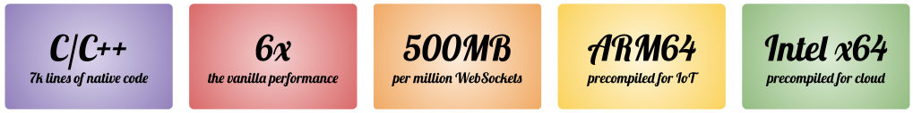

<div align="center">


*µWebSockets.js™ (it's "[micro](https://en.wikipedia.org/wiki/Micro-)") is simple, secure*<sup>[[1]](https://github.com/uNetworking/uWebSockets/tree/master/fuzzing)</sup> *& standards compliant*<sup>[[2]](https://unetworking.github.io/uWebSockets.js/report.pdf)</sup> *web I/O for the most demanding*<sup>[[3]](https://github.com/uNetworking/uWebSockets/tree/master/benchmarks)</sup> *of applications.*

• [TypeScript docs](https://unetworking.github.io/uWebSockets.js/generated/) • [Read more & user manual (C++ project)](https://github.com/uNetworking/uWebSockets/blob/master/misc/READMORE.md)

*© 2016-2019, >39,632,272 downloads*

</div>

#### In a nutshell.

Think of it as a complete replacement to both Express.js and Socket.IO, written entirely in C/C++ for maximum performance and reliability. There are tons of [examples](examples) but here's the gist of it all:

```javascript
/* Non-SSL is simply App() */
require('uWebSockets.js').SSLApp({

  /* There are tons of SSL options */
  key_file_name: 'misc/key.pem',
  cert_file_name: 'misc/cert.pem',
  
}).ws('/*', {

  /* For brevity we skip the other events */
  message: (ws, message, isBinary) => {
    let ok = ws.send(message, isBinary);
  }
  
}).any('/*', (res, req) => {

  /* Let's deny all Http */
  res.end('Nothing to see here!');
  
}).listen(9001, (listenSocket) => {

  if (listenSocket) {
    console.log('Listening to port 9001');
  }
  
});
```

#### Ready all thrusters.

Install with `npm install uNetworking/uWebSockets.js#v16.3.0` or any such [release](https://github.com/uNetworking/uWebSockets.js/releases). No compiler needed.



#### Pay what you want.
Commercially developed on a sponsored/consulting basis; BitMEX, Bitfinex and Coinbase are current or previous sponsors. Contact [me, the author](https://github.com/alexhultman) for support, feature development or consulting/contracting.


#### Know thy legal matters.

*µWebSockets.js is intellectual property licensed Apache 2.0 with limitations on trademark use. Forks must be clearly labelled as such and must not be confused with the original.*
