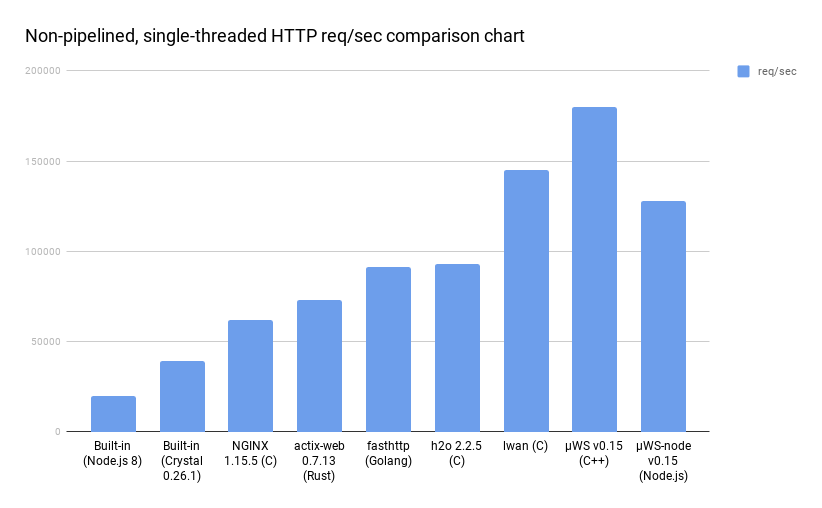

**µWebSockets.js** is a JavaScript platform, runtime and web server. It can serve Http about 6x that of Node.js and 12x that of Deno and outperforms Golang's fasthttp with ease.

There are two modes; compiled as a stand-alone JavaScript runtime or as a Node.js native addon.

```javascript
/* The stand-alone runtime has uWS namespace already loaded. */
var uWS = uWS ? uWS : require('../dist/uws.js');

const world = 'Strings are slower than ArrayBuffer but who cares for demo purose!';
const port = 3000;

uWS.App().get('/hello', (res, req) => {
  res.end(world);
}).get('/*', (res, req) => {
  res.writeHeader('content-type', 'text/html; charset= utf-8').end(req.getHeader('user-agent') + ' är din user agent, biatch!');
}).listen(port, (token) => {
  if (token) {
    console.log('Listening to port ' + port);
  } else {
    console.log('Failed to listen to port ' + port);
  }
});
```

### Benchmarks
Performance retention is up to 70% of native C++ µWebSockets v0.15.


### Kick-start
Easiest is to compile yourself a Node.js native addon. The following works for Linux and macOS systems:
```
git clone --recursive https://github.com/uNetworking/uWebSockets.js.git
cd uWebSockets.js
make
node examples/HelloWorld.js
```
