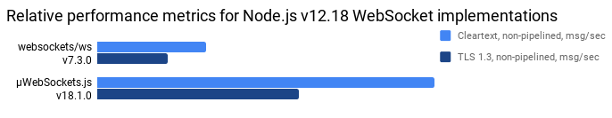

<div align="center">
<br>
<i>Simple, secure</i><sup><a href="https://github.com/uNetworking/uWebSockets/tree/master/fuzzing#fuzz-testing-of-various-parsers-and-mocked-examples">[1]</a></sup><i> & standards compliant</i><sup><a href="https://unetworking.github.io/uWebSockets.js/report.pdf">[2]</a></sup><i> web server for the most demanding</i><sup><a href="https://github.com/uNetworking/uWebSockets/tree/master/benchmarks#benchmark-driven-development">[3]</a></sup><i> of applications.</i> <a href="https://github.com/uNetworking/uWebSockets/blob/master/misc/READMORE.md">Read more...</a>
<br><br>


<a href="https://github.com/uNetworking/uWebSockets.js/releases"></a> <a href="https://lgtm.com/projects/g/uNetworking/uWebSockets.js/context:cpp"></a> 

[A note on speculation, lies & allegations](https://medium.com/@alexhultman/beware-of-tin-foil-hattery-f738b620468c)

</div>
<br><br>

### :bulb: Quite simple

µWebSockets.js is a C++ implementation of the Http/WebSocket protocols for Node.js, easy to use from JavaScript. Think of it as a faster Express.js/Socket.IO alternative; it comes with both router and pub/sub support. Browse the [documentation](https://unetworking.github.io/uWebSockets.js/generated/) and see the [main repo](https://github.com/uNetworking/uWebSockets). There are tons of [examples](examples) but here's the gist of it all:

```javascript
/* Non-SSL is simply App() */
require('uWebSockets.js').SSLApp({

  /* There are more SSL options, cut for brevity */
  key_file_name: 'misc/key.pem',
  cert_file_name: 'misc/cert.pem',
  
}).ws('/*', {

  /* There are many common helper features */
  idleTimeout: 30,
  maxBackpressure: 1024,
  maxPayloadLength: 512,
  compression: DEDICATED_COMPRESSOR_3KB,

  /* For brevity we skip the other events (upgrade, open, ping, pong, close) */
  message: (ws, message, isBinary) => {
    /* You can do app.publish('sensors/home/temperature', '22C') kind of pub/sub as well */
    
    /* Here we echo the message back, using compression if available */
    let ok = ws.send(message, isBinary, true);
  }
  
}).get('/*', (res, req) => {

  /* It does Http as well */
  res.writeStatus('200 OK').writeHeader('IsExample', 'Yes').end('Hello there!');
  
}).listen(9001, (listenSocket) => {

  if (listenSocket) {
    console.log('Listening to port 9001');
  }
  
});
```

### :muscle: Unfair advantage

Being written in native code directly targeting the Linux kernel makes it way faster than any JavaScript implementation.



### :crossed_swords: Battle proven
Runs the trading APIs of [Bitfinex.com](https://bitfinex.com), handling volumes of ~170 million USD every day. Also runs [Trello](https://trello.com), serving their 50 million users with real-time board updates.

### :package: Easily installed

Install with `npm install uNetworking/uWebSockets.js#v18.8.0` or any such [release](https://github.com/uNetworking/uWebSockets.js/releases). No compiler needed.

* Runs on Linux, macOS and Windows (ARM64, x64). Node.js 10, 11, 12, 13, 14 & 15.
* Installs from this GitHub repository, not the NPM registry; [hit "fork" to get your own copy](https://medium.com/@alexhultman/beware-of-tin-foil-hattery-f738b620468c).

### :briefcase: Commercially supported
<a href="https://github.com/uNetworking">uNetworking AB</a> is a Swedish consulting & contracting company dealing with anything related to µWebSockets; development, support and customer success.

Don't hesitate <a href="mailto:alexhultman@gmail.com">sending a mail</a> if you're building something large, in need of advice or having other business inquiries in mind. We'll figure out what's best for both parties and make sure you're not stepping into one of the many common pitfalls.

Special thanks to BitMEX, Bitfinex, Google, Coinbase, Bitwyre and deepstreamHub for allowing the project itself to thrive on GitHub since 2016 - this project would not be possible without these beautiful companies.


### :family: A family
µWebSockets.js is the Node.js integration of [µWebSockets](https://github.com/uNetworking/uWebSockets); the standalone C++ project. If performance is of utter importance, you don't necessarily have to use JavaScript/Node.js but could write apps in C++ using µWebSockets directly. It works exactly the same way, and will offer unbeatable performance for those highly demanding applications. Either way - the two projects both follow the same security testing, compliance testing and receive the same bug fixes and features. They are part of the same family.

### :handshake: Permissively licensed
Intellectual property, all rights reserved.

Where such explicit notice is given, source code is licensed Apache License 2.0 which is a permissive OSI license with very few limitations. If you're uncertain about your permissions, please ask before assuming.
