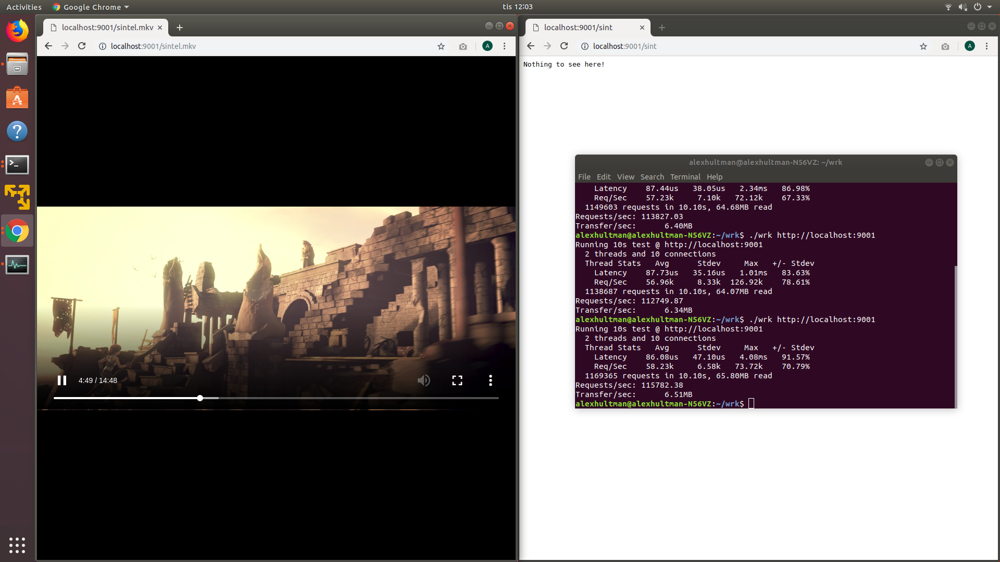

<div align="center">


*µWebSockets™ (it's "[micro](https://en.wikipedia.org/wiki/Micro-)") is simple, secure & standards compliant web I/O for the most demanding*<sup>[[1]](https://github.com/uNetworking/uWebSockets/tree/master/benchmarks)</sup> *of applications.*

• [TypeScript docs](https://unetworking.github.io/uWebSockets.js/generated/) • [Read more & user manual (C++ project)](https://github.com/uNetworking/uWebSockets/blob/master/misc/READMORE.md)

</div>

### Outrun, everyone.
This project is not your typical "web framework" a la 500 lines of JavaScript and a fancy logo. You're looking at a 3-part software suite of ~7k lines of C & C++, working in unison with Google V8 to bring you one of the most memory scalable and performant I/O scriping environment available.

It runs 15x faster than Deno and scales to millions of connections on small devices.

[Read the Medium post](https://levelup.gitconnected.com/will-node-js-forever-be-the-sluggish-golang-f632130e5c7a)

### No compiler needed.
We use AppVeyor & TravisCI to automatically pre-compile binaries for Linux, macOS and Windows with every push. New releases are tagged from branch `binaries` and can be installed [using NPM](https://docs.npmjs.com/cli/install) like so:

```
npm install uNetworking/uWebSockets.js#v15.1.0
```

where `v15.1.0` is the particular Git tag you wanted to use.

### In a nutshell
There are tons of [examples](examples) but here's the gist of it all:

```javascript
const uWS = require('../dist/uws.js');
const port = 9001;

const app = uWS.SSLApp({
  key_file_name: 'misc/key.pem',
  cert_file_name: 'misc/cert.pem',
  passphrase: '1234'
}).ws('/*', {
  /* Options */
  compression: 0,
  maxPayloadLength: 16 * 1024 * 1024,
  idleTimeout: 10,
  /* Handlers */
  open: (ws, req) => {
    console.log('A WebSocket connected via URL: ' + req.getUrl() + '!');
  },
  message: (ws, message, isBinary) => {
    /* Ok is false if backpressure was built up, wait for drain */
    let ok = ws.send(message, isBinary);
  },
  drain: (ws) => {
    console.log('WebSocket backpressure: ' + ws.getBufferedAmount());
  },
  close: (ws, code, message) => {
    console.log('WebSocket closed');
  }
}).any('/*', (res, req) => {
  res.end('Nothing to see here!');
}).listen(port, (token) => {
  if (token) {
    console.log('Listening to port ' + port);
  } else {
    console.log('Failed to listen to port ' + port);
  }
});
```

### Streams
Proper streaming of huge data is supported over Http/Https and demonstrated with examples. Here's a shot of me watching real-time streamed HD video from Node.js while simultaneously scoring a 115k req/sec with wrk. For my computer, that's about 5x that of vanilla Node.js (without any HD video streaming/playing).



### Pub/sub
WIP section --

### Benchmarks
In the following charts "µWS v0.15" denote the C++ project - performance retention for µWebSockets.js inside of V8 is about 65-75%, similar to or above the top performing Golang modules. User space memory usage for a million WebSockets is in the 100-400mb range.

Http | WebSockets | PubSub
--- | --- | ---
 |  | todo: Socket.IO, SocketCluster, ClusterWS

### Build from source
#### Recursively clone, and enter, this repo:
```
git clone --recursive https://github.com/uNetworking/uWebSockets.js.git
cd uWebSockets.js
```
#### For Unix (Linux, macOS):
```
make
```
#### For Windows (in an x64 developer terminal):
```
nmake Windows
```
#### Test it out
```
node examples/HelloWorld.js
```
